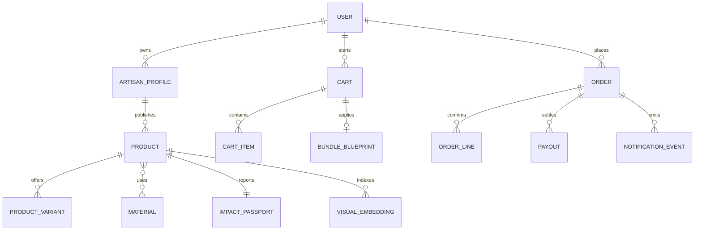

# Domain Model

## Core entities

- `User`: authenticated actor with buyer, artisan, or admin capabilities
- `ArtisanProfile`: public shop identity, story, sustainability practices, payout details
- `Material`: normalized source material with provenance and eco attributes
- `Product`: sellable listing owned by an artisan
- `ProductVariant`: inventory-aware purchasable option
- `ImpactPassport`: evidence-backed sustainability record for a product
- `BundleBlueprint`: curated or shopper-built grouping of products
- `Cart`: active session with reserved stock and applied discounts
- `Order`: confirmed transaction spanning one or more vendors
- `Payout`: vendor settlement record tied to Stripe transfers
- `NotificationEvent`: outbound automation trigger from RabbitMQ
- `VisualEmbedding`: image vector stored in PostgreSQL for similarity search

## Relationship map

## Product model notes

- A product must carry artisan attribution, material tags, sustainability claims, and media metadata.
- Impact scoring is derived from sourcing, packaging, durability, and fulfillment distance signals.
- Visual search stores one or more embeddings per product image to support nearest-neighbor matching.
- Bundle pricing is a first-class concept because the platform differentiates on coordinated sustainable shopping.

## Proposed PostgreSQL schemas

- `catalog`: products, variants, materials, product_materials, media_assets, impact_passports, embeddings
- `vendors`: artisan_profiles, payout_accounts, vendor_metrics
- `orders`: carts, cart_items, orders, order_lines, stock_reservations, payouts
- `analytics`: events, experiment_assignments, funnel_snapshots

## Sprint sequence fit

- Sprint 1: schema design, entity definitions, API contracts
- Sprint 2: auth, vendor onboarding, product management
- Sprint 3: carts, reservations, OMS
- Sprint 4: embeddings, similarity search, hybrid filters
- Sprint 5+: AI assistant, checkout, and automation layers
